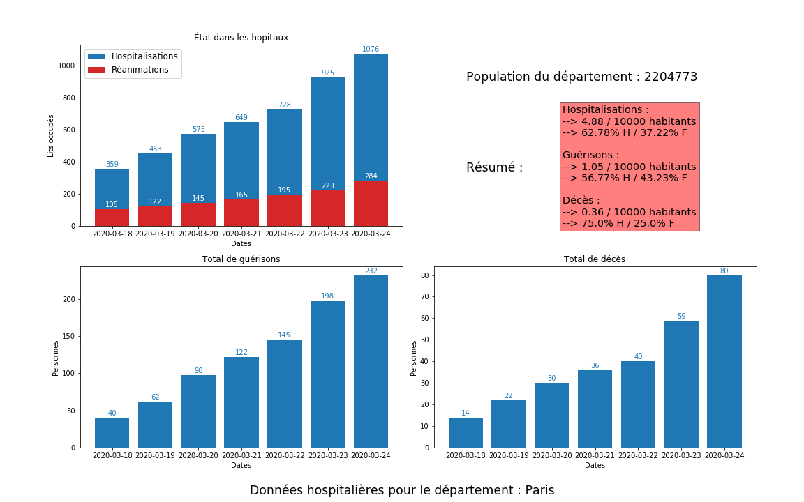
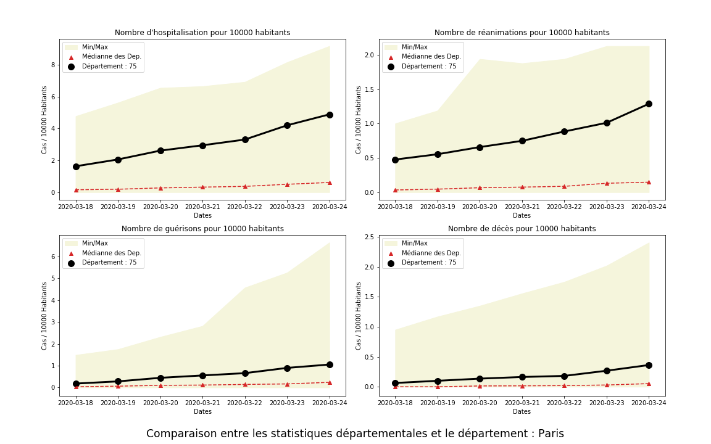

# Covid-19
Analyse des données sur le Covid-19 fournies par Santé Publique France


## Les données

- ### Données liées au Covid-19

Récupérées sur le site des données publiques françaises et provenant de Santé Publique France, mises à jour quotidiennement.

Lien : https://www.data.gouv.fr/fr/datasets/donnees-relatives-a-lepidemie-du-covid-19/#_


- ### Données liées au recencement de la population française

Récupérées sur le site de l'INSEE. Données parues le 30/12/2019 et correspondantes à la population française en 2017, réparties par département.

Lien : https://www.insee.fr/fr/statistiques/4265429?sommaire=4265511


## Explications

Le fichier `data-visualisation.ipynb` comporte, entre autres, deux fonctions :
- *afficheDepartement*, qui donne des informations propres à un département.
- *departementVsTous*, qui positionne un département par rapport aux autres.


## Exemple

```python
idDep = 75
afficheDepartement(idDep)
departementVsTous(idDep)
```


