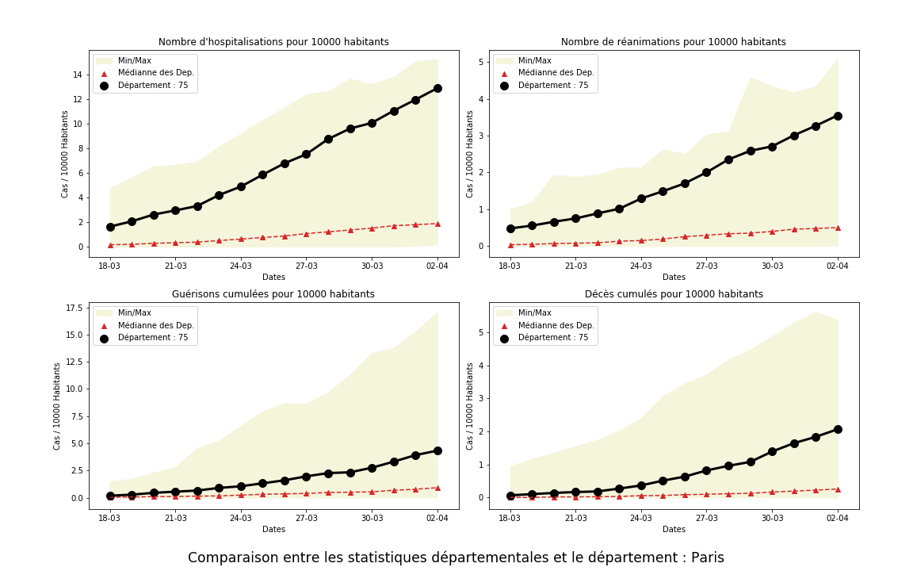
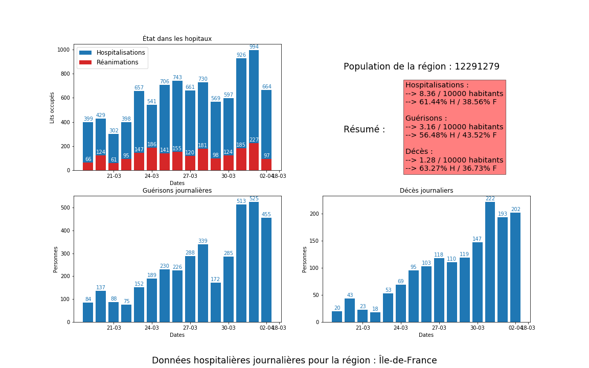
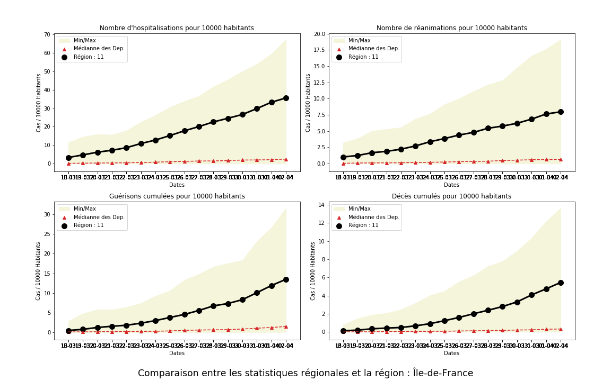
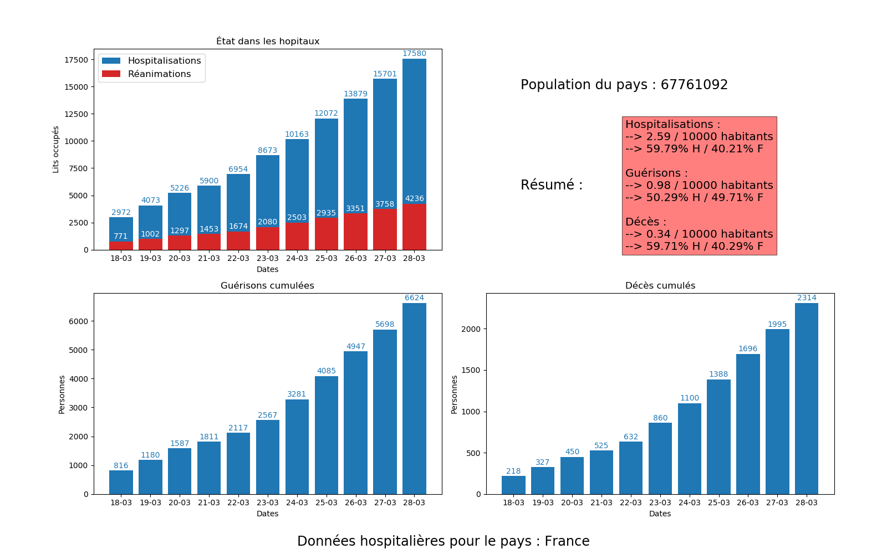
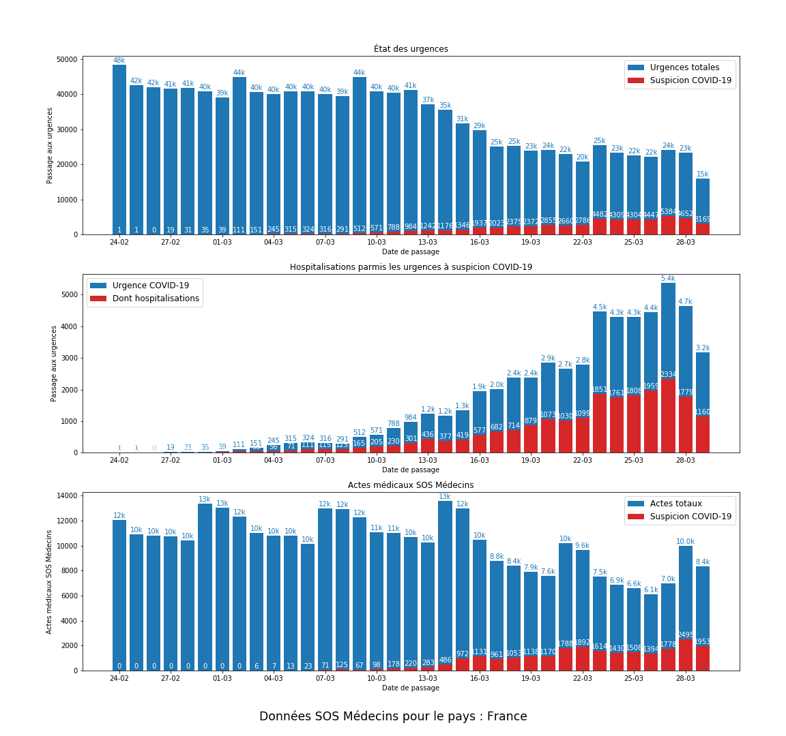
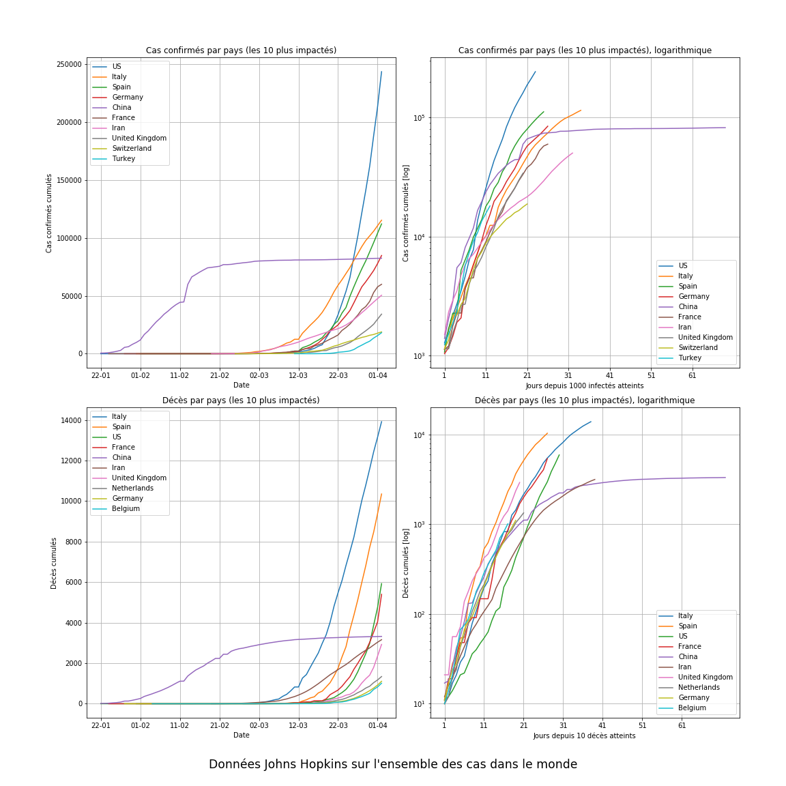

# Covid-19
Analyse des données sur le Covid-19 fournies par Santé Publique France et l'université Johns Hopkins.


## Les données

- ### Données hospitalières relatives à l'épidémie de COVID-19

Récupérées sur le site des données publiques françaises et provenant de Santé Publique France, mises à jour quotidiennement.

Lien : https://www.data.gouv.fr/fr/datasets/donnees-hospitalieres-relatives-a-lepidemie-de-covid-19/


- ### Données des urgences hospitalières et de SOS médecins relatives à l'épidémie de COVID-19

Récupérées sur le site des données publiques françaises et provenant de Santé Publique France, mises à jour quotidiennement.

Lien : https://www.data.gouv.fr/fr/datasets/donnees-des-urgences-hospitalieres-et-de-sos-medecins-relatives-a-lepidemie-de-covid-19/


- ### Données liées au recencement de la population française

Récupérées sur le site de l'INSEE. Données parues le 30/12/2019 et correspondantes à la population française en 2017, réparties par département.

Lien : https://www.insee.fr/fr/statistiques/4265429?sommaire=4265511


- ### Données du découpage des communes française

Récupérées sur le site de l'INSEE. Données parues le 26/02/2020 et correspondantes au code officiel géographique au premier janvier 2020.

Lien : https://www.insee.fr/fr/information/4316069


- ### Données du mondiales de l'université Johns Hopkins

Récupérées sur le dépôt GitHub, et mises à jour quotidiennement.

Lien : https://github.com/CSSEGISandData/COVID-19


## Explications

Le fichier `data_visualisation.ipynb` comporte, entre autres, les fonctions :
- *afficheDepartement*, qui donne des informations propres à un département (en données cumulées et journalières).
- *departementVsTous*, qui positionne un département par rapport aux autres.
- *afficheRegion*, qui donne des informations propres à une région (en données cumulées et journalières).
- *regionVsTous*, qui positionne une région par rapport aux autres.
- *affichePays*, qui donne des informations propres au pays (en données cumulées et journalières).
- *sosMedecins*, qui donne des informations journalières sur les urgences totale et du Covid et les interventions SOS Médecins, pour les départements, régions ou pays.
- *afficheMonde*, qui donne des informations d'évolution de chaque pays.


## Exemples

```python
idDep = 75
afficheDepartement(idDep)
departementVsTous(idDep)
```




```python
idReg = 11
afficheRegion(idReg)
regionVsTous(idReg)
```




```python
affichePays()
```



```python
sosMedecins()
```



```python
afficheMonde()
```



## Serveur de développement Flask

Ces fonction sont intégrées dans un serveur dans le dossier `app`.


## Modules Python utilisés

os, datetime, Pandas, seaborn, matplotlib

Flask, Flask-SQLAlchemy, Flask-Migrate, Flask-Login, Flask-WTF, WTForms, Werkzeug 
